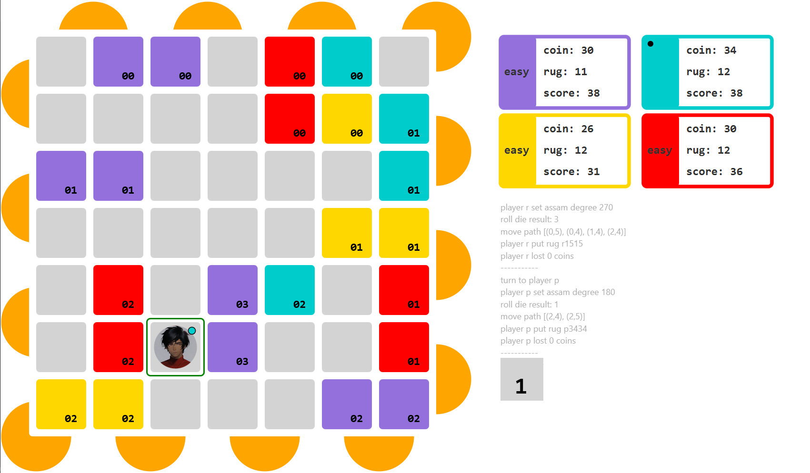

# Marrakech

Java-based digital remake of the board game [Marrakech](https://boardgamegeek.com/boardgame/29223/marrakech), where players play as rug merchants competing against each other. The aim of the game is to get the most number of coins / dirhams (money) by placing carpets on the board. 

**Tech Stack: Java, JavaFX**

## Project Credits
This project was developed collaboratively by a team of three developers: **Tashia Tamara / Myself, Xinyang Li, and Jiangbei Zhang**. It was originally created as an academic project at the Australian National University.  
This repository is a mirrored copy for portfolio purposes.

## General Game Rules
1. The game can be played by a minimum of 2 players and a maximum of 4 players.
2. On their turn, each player chooses the direction they want Assam (the character / market owner) to face. Assam can be rotated 90 degrees each time. A 180 degree rotation would be invalid.
3. Roll the die and move Assam forward as many spaces as the number of the die. If Assam reaches a mosaic track (semicircle-shaped tile at the board edges), follow the curve and continue moving to the next row.
4. If Assam lands on an opponent's carpet, the player has to pay them 1 coin / dirham per visible square of that color.
5. Place one of your carpets adjacent to Assam, but you may not directly overlay another player's carpet. Each player has their own carpet color.
6. The game ends when all players have placed their carpets. The player with the most coins wins.

## General Game Controls
Players can use the arrow keys to select the direction and the Enter key to confirm the direction.  
Press the Esc key to pause the game.

## Notable Game Features
1. AI Players: The player can play against normal or hard AI players. Normal AI players make random moves, while hard AI players use math calculations to make the most optimal in-game decisions.
2. Glass Mode: A special mode where each player is only given 1 coin / dirham, so the game ends quicker.
3. Assam Hint Border: A green border around Assam's current tile / position that will turn red when the player is considering to turn to an invalid direction (a direction where a 180 degree turn would be required).
